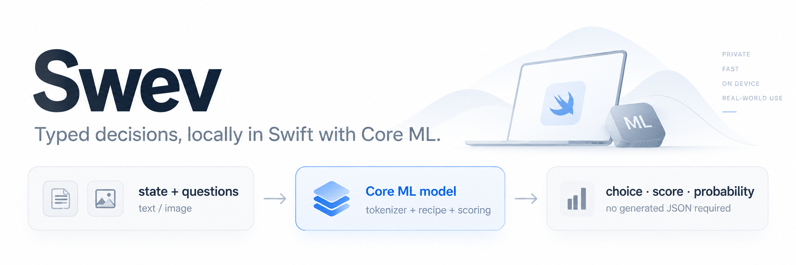

**Jev-style typed decisions, locally in Swift with Core ML.**

Swev is a Swift package for running typed decision models locally with Core ML—text or images in, choices, scores, and probabilities out.

Define the question and possible answers in your app. Swev scores those answers and returns typed Swift values, without generating text or asking a model to format JSON. Use it to route requests, classify content, rank urgency, or ask questions about an image.

- **Local inference.** Inputs stay on-device. No inference API, Python runtime, or third-party runtime dependencies.
- **Questions defined at runtime.** Choose among your own options, score an ordered scale, or request a probability of true.
- **One self-contained model package.** Tokenizer, formatting, and scoring settings travel with the weights. Image-capable packages include a text route that skips vision computation when no image is supplied.

**Swift 6 · macOS 15+ · iOS 18+ · MIT license**

[Quickstart](#quickstart) · [Models](#models) · [Image input](#image-input) · [Documentation](#documentation)

## Quickstart

Add `https://github.com/danielamitay/swev` in Xcode’s **Add Package Dependencies**, or use Swift Package Manager:

```swift
.package(url: "https://github.com/danielamitay/swev.git", branch: "main")
```

Add `.product(name: "Swev", package: "swev")` to your target’s dependencies.

Load a compatible model from Hugging Face and ask a question from an `async` throwing function:

```swift
import Swev

let model = try await SwevModel.load(
    from: HuggingFaceModel(
        repository: "danielamitay/gemma-4-e2b-it-lut4-g8-swev",
        package: "gemma-4-e2b-it-lut4-g8-swev-l4096-k16.mlpackage"
    ),
    configuration: .init(computeUnits: .cpuAndGPU)
)

let response = try await model.predict(
    state: "My order arrived with the wrong item. Can you help?",
    questions: [
        .choice(
            id: "route",
            instructions: "Which team should handle this message?",
            options: [
                .init(id: "support", description: "Help with existing orders"),
                .init(id: "sales", description: "Questions about buying a product"),
                .init(id: "other", description: "Anything else")
            ]
        )
    ]
)

let answer = try response.choice("route")
print(answer.choice)        // Selected option ID
print(answer.probabilities) // Probability for every option
```

The first load downloads the package. Subsequent loads reuse the local download cache; keep the model instance alive to avoid recompiling and initializing it for every request. Once downloaded, inference works offline. You can also load a local package with `SwevModel.load(from: modelURL)`.

**Try it without creating an app:** clone this repository and run the [complete command-line example](Examples/README.md) on macOS:

```sh
swift run --package-path Examples/Decisions -c release Decisions \
  danielamitay/gemma-4-e2b-it-lut4-g8-swev \
  gemma-4-e2b-it-lut4-g8-swev-l4096-k16.mlpackage
```

The first run downloads about 2.44 GB. The example asks three text questions; append an image path to try vision instead.

## Three question types

| Question | Use it for | Result |
| --- | --- | --- |
| `choice` | Routing or classification with your own labels | Selected option and a probability for every candidate |
| `score` | An ordered scale such as low / medium / high | Expected zero-based level and its probability distribution |
| `noul` | A yes/no question | Probability of true, from 0 to 1 |

Ask several questions about the same state in one request:

```swift
let response = try await model.predict(
    state: "Checkout is failing for every customer. Please investigate immediately.",
    questions: [
        .score(id: "urgency", instructions: "How urgent is this issue?",
               levels: ["low", "medium", "high"]),
        .noul(id: "actionable", instructions: "Does this message request action?")
    ]
)

print(try response.score("urgency").score)     // Expected level between 0 and 2
print(try response.noul("actionable").noul)   // Probability of true
```

State and instructions accept strings or structured `JSONValue` data. Questions are evaluated independently. Probabilities describe the model’s predictions; a confidence statistic is not a guarantee of correctness.

## Models

Browse the [Swev collection on Hugging Face](https://huggingface.co/collections/danielamitay/swev-6ab07cfe05f6ef97171a04e4). These exports bundle everything Swev needs. To switch models, change the repository and package name in the quickstart. Each repository contains `<repository-name>-l4096-k16.mlpackage`.

| Model | Size (disk) | Precision | CPU latency (mean) | JevBench accuracy | Vision? |
| --- | ---: | --- | ---: | ---: | :---: |
| [Gemma 4 E2B IT · FP32](https://huggingface.co/danielamitay/gemma-4-e2b-it-fp32-swev) | 19.16 GB | FP32 | 2.76 s | 63.2% | Yes |
| [Gemma 4 E2B IT · LUT4](https://huggingface.co/danielamitay/gemma-4-e2b-it-lut4-g8-swev) | 2.44 GB | 4-bit palette, group 8 | 6.66 s | 65.4% | Yes |
| [Gemma 4 E2B IT · LUT8](https://huggingface.co/danielamitay/gemma-4-e2b-it-lut8-tensor-swev) | 4.82 GB | 8-bit palette, per tensor | 4.34 s | 62.8% | Yes |
| [SmolVLM 500M Instruct](https://huggingface.co/danielamitay/smolvlm-500m-instruct-fp32-swev) | 2.04 GB | FP32 | 1.61 s | 42.4% | Yes |
| [Kev 0.5B](https://huggingface.co/danielamitay/kev-0.5b-fp32-swev) | 1.99 GB | FP32 | 1.46 s | 49.8% | No |
| [Kev 0.6B](https://huggingface.co/danielamitay/kev-0.6b-fp32-swev) | 2.40 GB | FP32 | 2.24 s | 60.6% | No |
| [Kev 4B](https://huggingface.co/danielamitay/kev-4b-fp32-swev) | 16.11 GB | FP32 | 12.14 s | 66.7% | No |
| [Laya EN](https://huggingface.co/danielamitay/laya-en-fp32-swev) | 1.69 GB | FP32 | 1.56 s | 55.8% | No |

**Compute policy:** the quickstart uses CPU+GPU. Use `.cpuOnly` for Gemma FP32 (Metal crash) and Kev 4B (no meaningful speedup and excessive memory at the largest GPU context). See [compute policy and measured latency](docs/performance.md) before switching packages.

SmolVLM requires the tokenizer support in Swev commit [`4213de1`](https://github.com/danielamitay/swev/commit/4213de175031723f43b500820af1ad48db6baab4) or later. Use the latest `main` when loading it.

All eight exports support **4,096 text tokens**, **16 answer options per question**, and **64 questions per request**. Context includes the state, question, options, and formatting; per-field limits also apply. Shorter requests use smaller context buckets. Gemma and SmolVLM image routes have a separate **256-token** budget, including 64 image tokens. Oversized requests throw rather than silently truncate.

All models were tested against **231 public JevBench cases**. SmolVLM answered 230; one prompt required 4,104 tokens and exceeded its context limit. Every other model answered all 231. Accuracy counts the unanswered case as incorrect; latency averages successful predictions and excludes loading and warmup. Runs occurred under different background system loads, so the timings are not controlled speed comparisons.

<details>
<summary>Measurement details and precision</summary>

Accuracy is correct answers divided by all [231 public cases](https://github.com/fstandhartinger/jevbench/tree/275763201a29d6083d4ee1431d709c296ef81281). These are text-only public-subset results, not the official 534-case leaderboard, and do not measure vision quality.

Latency is one serial pass on an Apple M4 Max with 128 GiB RAM, using Swift/Core ML CPU-only. It includes tokenization and inference, excludes model loading and per-bucket warmup, and groups requests by context size. Cold loads and switching context buckets can add latency. For a separate CPU/GPU comparison and compatibility notes, see [compute policy](docs/performance.md). iOS devices need their own validation.

Sizes are decimal GB on disk, not runtime memory requirements. Palette exports compress weights while retaining FP32 computation; they do not use NVFP4/NVFP8 arithmetic. These models are Apache 2.0; source checkpoints and conversion details are linked in their model cards.

</details>

## Image input

Use any Gemma or SmolVLM package above for text alone or text plus one PNG/JPEG. With the same `model` from the quickstart:

```swift
import Foundation

let imageURL = URL(fileURLWithPath: "/path/to/photo.png")
let imageData = try Data(contentsOf: imageURL)
let response = try await model.predict(
    state: "Look at the attached image.",
    questions: [
        .choice(id: "scene", instructions: "Where was this photo taken?",
                options: [.init(id: "indoors"), .init(id: "outdoors")])
    ],
    images: [.init(data: imageData, contentType: "image/png")]
)

print(try response.choice("scene").choice)
```

For JPEG bytes, use `image/jpeg`. You can check `model.descriptor.capabilities.supportsImages` before attaching an image. Gemma exports fit images to a 384 × 384 canvas; SmolVLM uses 512 × 512. Both use one fitted image rather than multiple crops. Text-only requests skip the vision encoder; audio, video, and multiple images are not supported.

## Documentation

- [Using Swev in an app](docs/usage.md) — structured state, typed answers, concurrency, and error handling.
- [Loading and caching](docs/huggingface.md) — revisions, offline use, private repositories, and cache policies.
- [Model support](docs/models.md) — capabilities, image processing, limits, and runtime behavior.
- [Converting models](docs/conversion.md) — export, package, compress, and validate compatible models.
- [Package schema](docs/schema.md) — versioned metadata, tokenizers, and inference contracts.
- [Evaluation](docs/evaluation.md) — run labeled cases and source-parity checks against your own model.
- [Runnable examples](Examples/README.md) — try text or image decisions from the command line.
- [Contributing](CONTRIBUTING.md) — development setup, repository map, tests, and pull requests.

Run `swift test` for the package tests. Model weights and generated reports stay outside Git. Swev is [MIT-licensed](LICENSE); model licenses are listed separately in their releases.
