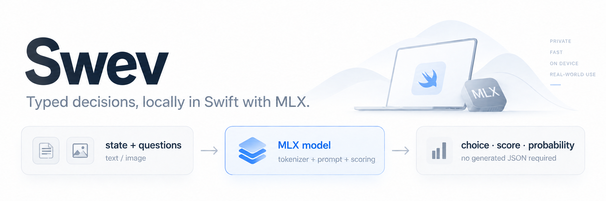

**Jev-style typed decisions, locally in Swift with MLX.**

Swev is a Swift package for running typed decision models locally with MLX—text or images in, choices, scores, and probabilities out.

Define the question and possible answers in your app. Swev scores those answers and returns typed Swift values, without generating text or asking a model to format JSON. Use it to route requests, classify content, rank urgency, or ask questions about an image.

- **Local inference.** Inputs stay on-device. No inference API or Python runtime. Model execution uses `mlx-swift-lm`.
- **Questions defined at runtime.** Choose among your own options, score an ordered scale, or request a probability of true.
- **Ordinary MLX models.** Load supported Hugging Face repositories or local model directories. No Swev export is required; text-only requests skip vision encoding.

**Swift 6.3 · macOS 15+ · iOS 18+ · MIT license**

[Quickstart](#quickstart) · [Models](#models) · [Image input](#image-input) · [Documentation](#documentation)

## Quickstart

Add `https://github.com/danielamitay/swev` in Xcode’s **Add Package Dependencies**, or use Swift Package Manager:

```swift
.package(url: "https://github.com/danielamitay/swev.git", branch: "mlx")
```

Add `.product(name: "Swev", package: "swev")` to your target’s dependencies.

Load a compatible model from Hugging Face and ask a question from an `async` throwing function:

```swift
import Swev

let model = try await SwevModel.load(
    hf: "mlx-community/SmolVLM-500M-Instruct-bf16"
)

let response = try await model.predict(
    state: "My order arrived with the wrong item. Can you help?",
    questions: [
        .choice(
            id: "route",
            instructions: "Which team should handle this message?",
            options: [
                .init(id: "support", description: "Help with existing orders"),
                .init(id: "sales", description: "Questions about buying a product"),
                .init(id: "other", description: "Anything else")
            ]
        )
    ]
)

let answer = try response.choice("route")
print(answer.choice)        // Selected option ID
print(answer.probabilities) // Probability for every option
```

The first load downloads the model; subsequent loads reuse the Hugging Face cache. Keep the model instance alive for repeated predictions. To load a local model directory without downloading:

```swift
import Foundation

let model = try await SwevModel.load(
    url: URL(fileURLWithPath: "/path/to/model-directory")
)
```

Build with Xcode so MLX's Metal shaders are compiled. See the [MLX setup and command-line quickstart](docs/mlx.md) for a runnable example.

## Three question types

| Question | Use it for | Result |
| --- | --- | --- |
| `choice` | Routing or classification with your own labels | Selected option and a probability for every candidate |
| `score` | An ordered scale such as low / medium / high | Expected zero-based level and its probability distribution |
| `noul` | A yes/no question | Probability of true, from 0 to 1 |

Ask several questions about the same state in one request:

```swift
let response = try await model.predict(
    state: "Checkout is failing for every customer. Please investigate immediately.",
    questions: [
        .score(id: "urgency", instructions: "How urgent is this issue?",
               levels: ["low", "medium", "high"]),
        .noul(id: "actionable", instructions: "Does this message request action?")
    ]
)

print(try response.score("urgency").score)     // Expected level between 0 and 2
print(try response.noul("actionable").noul)   // Probability of true
```

State and instructions accept strings or structured `JSONValue` data. Questions are evaluated independently. Probabilities describe the model’s predictions; a confidence statistic is not a guarantee of correctness.

## Models

These checkpoints were evaluated through the same Swev API on all **231 public JevBench cases**. Load their Hugging Face IDs directly; no Swev export is required. Results measure direct candidate scoring, with no generated reasoning or answer text.

| Model | Size (disk) | Precision | Latency (mean) | JevBench accuracy | Vision? |
| --- | ---: | --- | ---: | ---: | :---: |
| [Gemma 4 31B IT](https://huggingface.co/mlx-community/gemma-4-31b-it-4bit) | 18.44 GB | INT4 | 4.51 s | 91.3% | Yes |
| [Qwen3.8 27B](https://huggingface.co/mlx-community/Qwen3.8-27B-4bit) | 16.08 GB | INT4 | 3.62 s | 85.3% | Yes |
| [Ternary Bonsai 2 27B](https://huggingface.co/prism-ml/Ternary-Bonsai-2-27B-mlx-2bit) | 8.61 GB | 2-bit | 3.96 s | 84.4% | Yes |
| [Muse Glimmer 30B](https://huggingface.co/mlx-community/Muse-Glimmer-30B-4bit) | 19.44 GB | INT4 | 3.67 s | 83.1% | Yes |
| [GPT-OSS 20B](https://huggingface.co/mlx-community/gpt-oss-20b-MXFP4-Q8) | 12.10 GB | MXFP4 + INT8 | 743 ms | 72.7% | No |
| [Gemma 3 12B IT](https://huggingface.co/mlx-community/gemma-3-12b-it-4bit) | 8.07 GB | INT4 | 2.28 s | 69.3% | Yes |
| [Gemma 4 E2B IT](https://huggingface.co/mlx-community/gemma-4-e2b-it-4bit) | 3.58 GB | INT4 | 284 ms | 61.5% | Yes |
| [Laya 421M](https://huggingface.co/aac6fef/laya-mlx) | 0.85 GB | FP16 | 23 ms† | 48.9%† | No |
| [Qwen2-VL 2B](https://huggingface.co/mlx-community/Qwen2-VL-2B-mlx) | 4.43 GB | BF16 | 240 ms | 48.1% | Yes |
| [SmolVLM 500M Instruct](https://huggingface.co/mlx-community/SmolVLM-500M-Instruct-bf16) | 1.02 GB | BF16 | 76 ms | 45.0% | Yes |
| [SmolVLM 2.2B Instruct](https://huggingface.co/mlx-community/SmolVLM-Instruct-bf16) | 4.50 GB | BF16 | 275 ms | 44.6% | Yes |
| [SmolVLM 256M Instruct](https://huggingface.co/mlx-community/SmolVLM-256M-Instruct-bf16) | 0.52 GB | BF16 | 37 ms | 33.3% | Yes |

**Measurements:** Apple M4 Max with 128 GiB memory, Swift/MLX on the GPU. Requests run sequentially with one excluded warmup per case. Latency includes prompt preparation, tokenization, and inference; it excludes loading and file I/O. Accuracy uses the [pinned public JevBench suite](https://github.com/fstandhartinger/jevbench/tree/275763201a29d6083d4ee1431d709c296ef81281), not the official full leaderboard. Rejected requests count as incorrect. See [methodology and checkpoint revisions](docs/performance.md).

† Laya returned valid responses for 174/231 cases; its declared context and question-field budgets rejected 57. Its latency averages successful requests only. All other models returned valid responses for all 231 cases.

Gemma 3’s checkpoint omits its context declaration, so load it with an explicit bound:

```swift
let model = try await SwevModel.load(
    hf: "mlx-community/gemma-3-12b-it-4bit", maxContextTokens: 131_072
)
```

“Vision” means image requests were exercised separately; JevBench accuracy here is text-only. Sizes are approximate decimal GB of repository files, not runtime memory. Precision describes stored weights; INT4 is affine integer quantization. Model quality and speed depend on the workload and device.

Swev allows 26 answer options per question, 64 questions per request, and one image. Context and field limits depend on the checkpoint; oversized input is rejected rather than truncated. See [runtime compatibility and limits](docs/mlx.md).

## Image input

Models marked “Vision” accept text alone or text plus one PNG/JPEG. With the same `model` from the quickstart:

```swift
import Foundation

let imageURL = URL(fileURLWithPath: "/path/to/photo.png")
let imageData = try Data(contentsOf: imageURL)
let response = try await model.predict(
    state: "Look at the attached image.",
    questions: [
        .choice(id: "scene", instructions: "Where was this photo taken?",
                options: [.init(id: "indoors"), .init(id: "outdoors")])
    ],
    images: [.init(data: imageData, contentType: "image/png")]
)

print(try response.choice("scene").choice)
```

For JPEG bytes, use `image/jpeg`. You can check `model.descriptor.capabilities.supportsImages` before attaching an image. MLX handles model-specific resizing, normalization, and image tiling. Text-only requests skip the vision encoder; audio, video, and multiple images are not supported.

## Documentation

- [MLX usage, loading, and limits](docs/mlx.md) — Hub/local loading, images, runtime compatibility, and runnable commands.
- [Benchmark runner](Examples/Benchmark) — sequential evaluation with loading and warmup excluded from inference timing.
- [Contributing](CONTRIBUTING.md) — development setup, repository map, tests, and pull requests.

See [model compatibility](docs/models.md), [configuration formats](docs/schema.md), and [evaluation](docs/evaluation.md) for runtime details and validation.

Run `swift test` for the package tests. Model weights and generated reports stay outside Git. Swev is [MIT-licensed](LICENSE); model licenses are listed separately in their releases.
